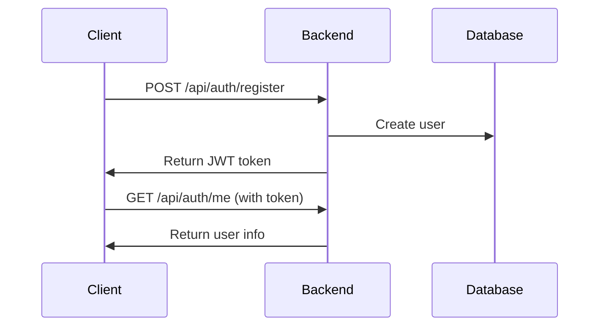
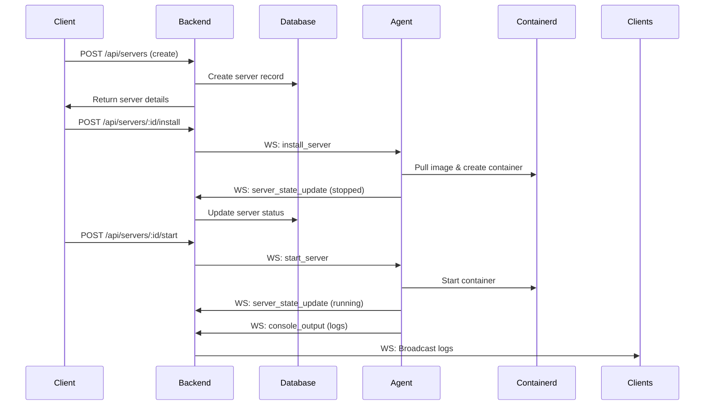
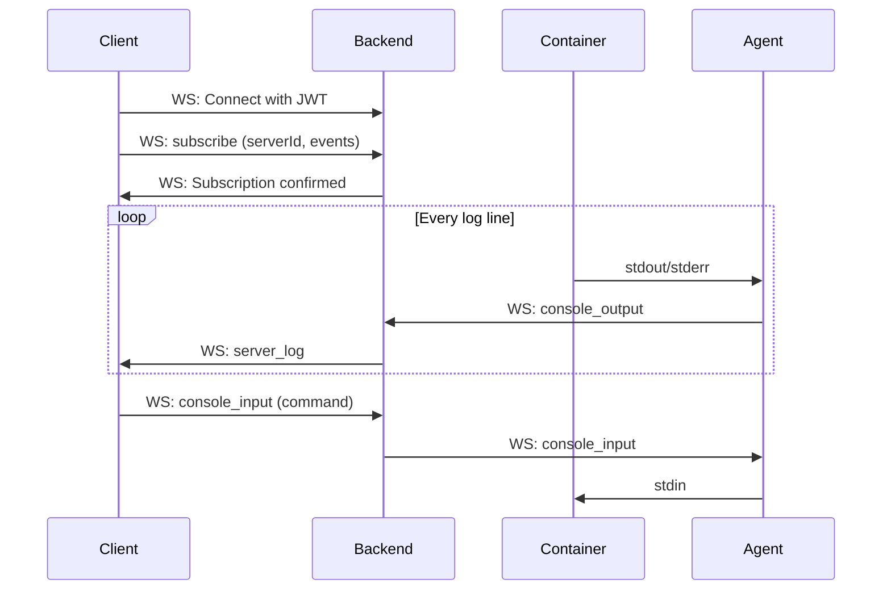
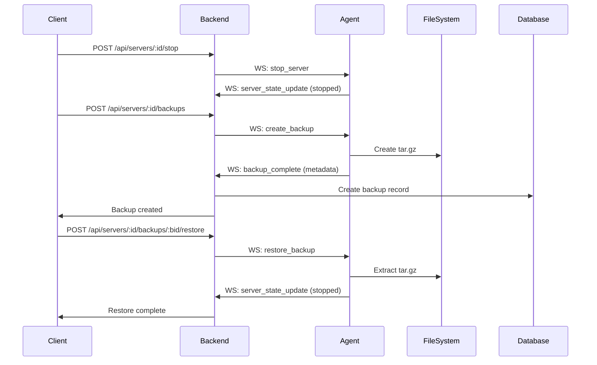
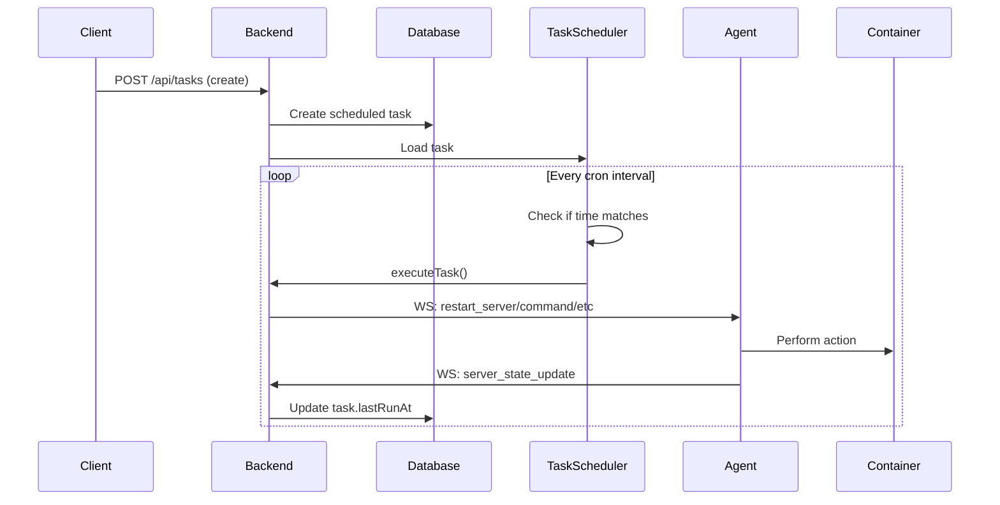
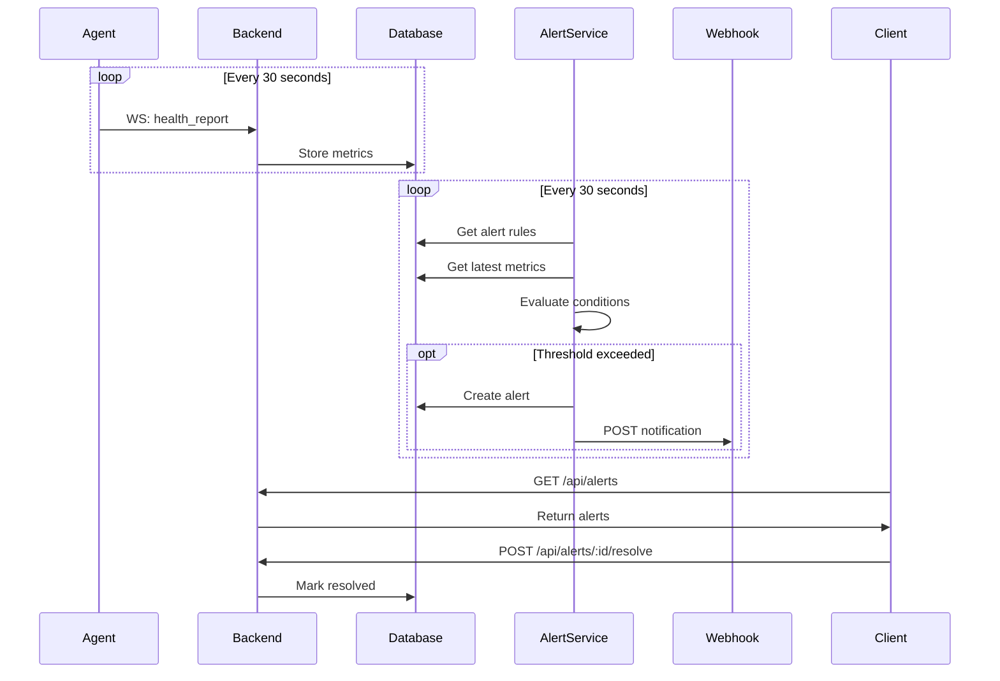
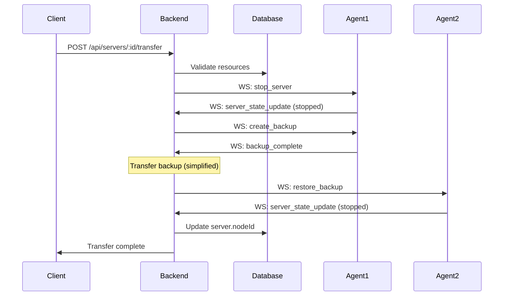
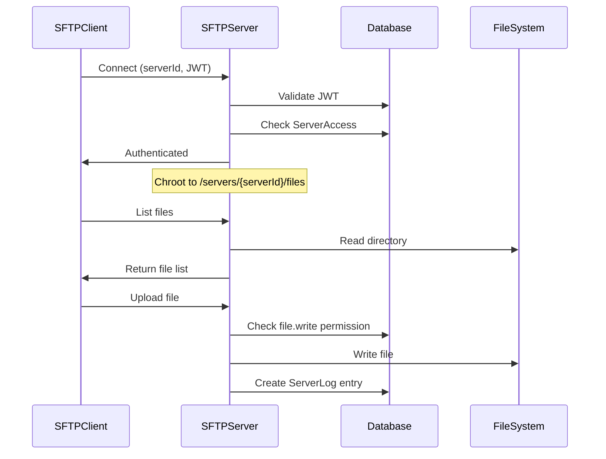

# Catalyst Backend - Complete API Documentation

**Version:** 1.0.0  
**Base URL:** `http://localhost:3000`  
**Protocol:** HTTP/1.1 + WebSocket  
**Authentication:** JWT Bearer Tokens

---

## Table of Contents

1. [Authentication](#authentication)
2. [Users & Roles](#users--roles)
3. [Nodes](#nodes)
4. [Templates](#templates)
5. [Servers](#servers)
6. [Console & Logs](#console--logs)
7. [File Management](#file-management)
8. [Backups](#backups)
9. [Scheduled Tasks](#scheduled-tasks)
10. [Alerts](#alerts)
11. [Admin APIs](#admin-apis)
12. [WebSocket Protocol](#websocket-protocol)
13. [SFTP Access](#sftp-access)
14. [Error Handling](#error-handling)
15. [Complete Flows](#complete-flows)

---

## Feature Parity (Wings)

**Implemented**
- Server lifecycle, templates, RBAC, metrics, SFTP, backups (local), tasks, alerts, IPAM pools

**Partial**
- Transfers (assumes shared storage; no cross-node copy)
- Backups (no retention rules or remote storage)
- Scheduler (nextRunAt is approximate; no catch-up)
- File archives (backend-only; agent compress/decompress not implemented)
- Crash handling (restartPolicy enforced; exit-code reporting)

**Missing**
- Secondary allocations/port bindings

---

## Authentication

### Register User

Create a new user account.

**Endpoint:** `POST /api/auth/register`  
**Authentication:** None  
**Rate Limit:** 10 requests/minute

**Request Body:**
```json
{
  "email": "user@example.com",
  "password": "SecurePassword123!",
  "username": "johndoe"
}
```

**Response:** `200 OK`
```json
{
  "success": true,
  "data": {
    "userId": "clrx12345abcd",
    "email": "user@example.com",
    "username": "johndoe",
    "token": "eyJhbGciOiJIUzI1NiIsInR5cCI6IkpXVCJ9..."
  }
}
```

**Errors:**
- `400` - Email already exists
- `400` - Invalid email format
- `400` - Password too weak (min 8 characters)

---

### Login

Authenticate and receive a JWT token.

**Endpoint:** `POST /api/auth/login`  
**Authentication:** None  
**Rate Limit:** 10 requests/minute

**Request Body:**
```json
{
  "email": "user@example.com",
  "password": "SecurePassword123!"
}
```

**Response:** `200 OK`
```json
{
  "success": true,
  "data": {
    "userId": "clrx12345abcd",
    "email": "user@example.com",
    "username": "johndoe",
    "token": "eyJhbGciOiJIUzI1NiIsInR5cCI6IkpXVCJ9..."
  }
}
```

**Token Payload:**
```json
{
  "userId": "clrx12345abcd",
  "email": "user@example.com",
  "username": "johndoe",
  "permissions": ["server.create", "server.start", "..."],
  "iat": 1706140800,
  "exp": 1706227200
}
```

**Errors:**
- `401` - Invalid credentials
- `404` - User not found

---

### Get Current User

Retrieve authenticated user information.

**Endpoint:** `GET /api/auth/me`  
**Authentication:** Required

**Response:** `200 OK`
```json
{
  "success": true,
  "data": {
    "id": "clrx12345abcd",
    "email": "user@example.com",
    "username": "johndoe",
    "createdAt": "2026-01-24T19:29:23.274Z"
  }
}
```

---

## Users & Roles

### List Users

Get all users in the system (admin only).

**Endpoint:** `GET /api/admin/users`  
**Authentication:** Required (admin.read permission)  
**Query Parameters:**
- `page` (optional): Page number (default: 1)
- `limit` (optional): Items per page (default: 20)

**Response:** `200 OK`
```json
{
  "success": true,
  "data": [
    {
      "id": "clrx12345abcd",
      "email": "user@example.com",
      "username": "johndoe",
      "roles": [
        {
          "id": "role123",
          "name": "Server Manager",
          "permissions": ["server.create", "server.start", "server.stop"]
        }
      ],
      "createdAt": "2026-01-24T19:29:23.274Z"
    }
  ],
  "pagination": {
    "page": 1,
    "limit": 20,
    "total": 45
  }
}
```

---

## Nodes

Nodes represent physical or virtual machines that run the Catalyst agent and host game servers.

### List Nodes

**Endpoint:** `GET /api/nodes`  
**Authentication:** Required

**Response:** `200 OK`
```json
{
  "success": true,
  "data": [
    {
      "id": "cmkspe7nu0002sw3chd4f3xru",
      "name": "production-1",
      "description": "Production game server node",
      "locationId": "cmkspe7nq0000sw3ctcc39e8z",
      "hostname": "node1.example.com",
      "publicAddress": "192.168.1.100",
      "maxMemoryMb": 32768,
      "maxCpuCores": 16,
      "isOnline": true,
      "lastSeenAt": "2026-01-25T02:29:17.413Z",
      "createdAt": "2026-01-24T19:29:23.274Z",
      "servers": [
        {
          "id": "server123",
          "name": "minecraft-lobby",
          "status": "running"
        }
      ]
    }
  ]
}
```

---

### Get Node Details

**Endpoint:** `GET /api/nodes/:nodeId`  
**Authentication:** Required

**Response:** `200 OK`
```json
{
  "success": true,
  "data": {
    "id": "cmkspe7nu0002sw3chd4f3xru",
    "name": "production-1",
    "description": "Production game server node",
    "locationId": "cmkspe7nq0000sw3ctcc39e8z",
    "hostname": "node1.example.com",
    "publicAddress": "192.168.1.100",
    "secret": "dev-secret-key-12345",
    "maxMemoryMb": 32768,
    "maxCpuCores": 16,
    "isOnline": true,
    "lastSeenAt": "2026-01-25T02:29:17.413Z",
    "createdAt": "2026-01-24T19:29:23.274Z",
    "updatedAt": "2026-01-25T02:29:17.414Z",
    "servers": [...]
  }
}
```

---

### Create Node

**Endpoint:** `POST /api/nodes`  
**Authentication:** Required (admin permission)

**Request Body:**
```json
{
  "name": "production-2",
  "description": "Second production node",
  "locationId": "location123",
  "hostname": "node2.example.com",
  "publicAddress": "192.168.1.101",
  "maxMemoryMb": 65536,
  "maxCpuCores": 32
}
```

**Response:** `201 Created`
```json
{
  "success": true,
  "data": {
    "id": "newnode123",
    "name": "production-2",
    "secret": "auto-generated-secret-key"
  }
}
```

---

### Update Node

**Endpoint:** `PUT /api/nodes/:nodeId`  
**Authentication:** Required (admin permission)

**Request Body:**
```json
{
  "name": "production-1-updated",
  "maxMemoryMb": 65536
}
```

**Response:** `200 OK`

---

### Delete Node

**Endpoint:** `DELETE /api/nodes/:nodeId`  
**Authentication:** Required (admin permission)

**Response:** `200 OK`
```json
{
  "success": true
}
```

**Errors:**
- `400` - Cannot delete node with active servers

---

### Generate Deployment Token

**Endpoint:** `POST /api/nodes/:nodeId/deployment-token`  
**Authentication:** Required (admin permission)

**Response:** `200 OK`
```json
{
  "success": true,
  "data": {
    "deploymentToken": "deployment-token-12345",
    "secret": "new-secret-key-12345",
    "deployUrl": "http://localhost:3000/api/deploy/deployment-token-12345",
    "expiresAt": "2026-01-25T02:29:17.413Z"
  }
}
```

---

## Templates

Templates define how servers should be installed and configured.

### List Templates

**Endpoint:** `GET /api/templates`  
**Authentication:** Required

**Response:** `200 OK`
```json
{
  "success": true,
  "data": [
    {
      "id": "template123",
      "name": "Minecraft Java Edition",
      "description": "Latest Minecraft server",
      "dockerImage": "itzg/minecraft-server:latest",
      "startCommand": "java -Xmx{{MEMORY}} -jar server.jar",
      "stopCommand": "stop",
      "ports": [
        {"internal": 25565, "external": 25565}
      ],
      "environment": {
        "EULA": "TRUE",
        "MEMORY": "{{MEMORY}}",
        "PORT": "{{PORT}}"
      },
      "requiredVariables": ["MEMORY", "PORT", "EULA"],
      "features": {
        "configFiles": ["/server.properties", "/server-advanced.properties"]
      },
      "createdAt": "2026-01-24T19:29:23.274Z"
    }
  ]
}
```

---

### Get Template Details

**Endpoint:** `GET /api/templates/:templateId`  
**Authentication:** Required

**Response:** `200 OK`

---

### Create Template

**Endpoint:** `POST /api/templates`  
**Authentication:** Required (admin permission)

**Request Body:**
```json
{
  "name": "Minecraft Java Edition",
  "description": "Latest Minecraft server",
  "dockerImage": "itzg/minecraft-server:latest",
  "startCommand": "java -Xmx{{MEMORY}} -jar server.jar",
  "stopCommand": "stop",
  "ports": [
    {"internal": 25565, "external": 25565}
  ],
  "environment": {
    "EULA": "TRUE",
    "MEMORY": "{{MEMORY}}",
    "PORT": "{{PORT}}"
  },
  "requiredVariables": ["MEMORY", "PORT", "EULA"]
}
```

**Response:** `201 Created`

---

## Servers

Core server management endpoints.

### List Servers

**Endpoint:** `GET /api/servers`  
**Authentication:** Required  
**Query Parameters:**
- `nodeId` (optional): Filter by node
- `status` (optional): Filter by status

**Response:** `200 OK`
```json
{
  "success": true,
  "data": [
    {
      "id": "server123",
      "uuid": "8fec71a3-9d19-45f7-8362-900674cde45c",
      "name": "minecraft-lobby",
      "description": "Main lobby server",
      "nodeId": "node123",
      "templateId": "template123",
      "status": "running",
      "allocatedMemoryMb": 4096,
      "allocatedCpuCores": 2,
      "allocatedDiskMb": 10240,
      "primaryPort": 25565,
      "networkMode": "bridge",
      "containerName": "catalyst-8fec71a3",
      "cpuUsage": 45.2,
      "memoryUsageMb": 2048,
      "createdAt": "2026-01-24T19:29:23.274Z",
      "updatedAt": "2026-01-25T02:29:17.414Z"
    }
  ]
}
```

**Server Statuses:**
- `stopped` - Server is not running
- `installing` - Container is being created
- `starting` - Server is starting up
- `running` - Server is running
- `stopping` - Server is shutting down
- `crashed` - Server exited unexpectedly
- `transferring` - Server is being moved to another node
- `suspended` - Server is suspended (blocked from actions)

---

### Get Server Details

**Endpoint:** `GET /api/servers/:serverId`  
**Authentication:** Required

**Response:** `200 OK`
```json
{
  "success": true,
  "data": {
    "id": "server123",
    "uuid": "8fec71a3-9d19-45f7-8362-900674cde45c",
    "name": "minecraft-lobby",
    "description": "Main lobby server",
    "node": {
      "id": "node123",
      "name": "production-1",
      "hostname": "node1.example.com"
    },
    "template": {
      "id": "template123",
      "name": "Minecraft Java Edition",
      "dockerImage": "itzg/minecraft-server:latest"
    },
    "status": "running",
    "allocatedMemoryMb": 4096,
    "allocatedCpuCores": 2,
    "allocatedDiskMb": 10240,
    "primaryPort": 25565,
    "networkMode": "bridge",
    "environment": {
      "EULA": "TRUE",
      "MEMORY": "4096M",
      "PORT": "25565"
    },
    "containerName": "catalyst-8fec71a3",
    "containerId": "docker-container-id",
    "cpuUsage": 45.2,
    "memoryUsageMb": 2048,
    "networkSent": 1234567,
    "networkReceived": 7654321,
    "crashCount": 0,
    "lastCrashAt": null,
    "restartPolicy": "always",
    "maxCrashCount": 5,
    "createdAt": "2026-01-24T19:29:23.274Z",
    "updatedAt": "2026-01-25T02:29:17.414Z"
  }
}
```

---

### Create Server

**Endpoint:** `POST /api/servers`  
**Authentication:** Required (server.create permission)

**Request Body:**
```json
{
  "name": "minecraft-lobby",
  "description": "Main lobby server",
  "templateId": "template123",
  "nodeId": "node123",
  "locationId": "location123",
    "allocatedMemoryMb": 4096,
    "allocatedCpuCores": 2,
    "allocatedDiskMb": 10240,
    "primaryPort": 25565,
    "portBindings": {
      "25565": 25565,
      "25575": 25575
    },
  "networkMode": "bridge",
  "environment": {
    "EULA": "TRUE",
    "MEMORY": "4096M",
    "PORT": "25565"
  }
}
```

**Response:** `201 Created`
```json
{
  "success": true,
  "data": {
    "id": "server123",
    "uuid": "8fec71a3-9d19-45f7-8362-900674cde45c",
    "name": "minecraft-lobby",
    "status": "stopped",
    ...
  }
}
```

**Errors:**
- `400` - Missing required template variables
- `400` - Node does not have enough resources
- `404` - Template or node not found

---

### List Allocations

List all port bindings for a server.

**Endpoint:** `GET /api/servers/:serverId/allocations`  
**Authentication:** Required (server.read permission or server owner)

**Response:** `200 OK`
```json
{
  "success": true,
  "data": [
    {
      "containerPort": 25565,
      "hostPort": 25565,
      "isPrimary": true
    }
  ]
}
```

---

### Add Allocation

Add a new port binding to a server (server must be stopped).

**Endpoint:** `POST /api/servers/:serverId/allocations`  
**Authentication:** Required (server.update permission or server owner)

**Request Body:**
```json
{
  "containerPort": 25566,
  "hostPort": 25570
}
```

**Response:** `200 OK`
```json
{
  "success": true,
  "data": {
    "containerPort": 25566,
    "hostPort": 25570,
    "isPrimary": false
  }
}
```

---

### Remove Allocation

Remove a non-primary port binding (server must be stopped).

**Endpoint:** `DELETE /api/servers/:serverId/allocations/:containerPort`  
**Authentication:** Required (server.update permission or server owner)

**Response:** `200 OK`
```json
{ "success": true }
```

---

### Set Primary Allocation

Promote an existing allocation to primary (server must be stopped).

**Endpoint:** `POST /api/servers/:serverId/allocations/primary`  
**Authentication:** Required (server.update permission or server owner)

**Request Body:**
```json
{
  "containerPort": 25566
}
```

**Response:** `200 OK`
```json
{
  "success": true,
  "data": {
    "primaryPort": 25566
  }
}
```

---

### Update Server

**Endpoint:** `PUT /api/servers/:serverId`  
**Authentication:** Required (server.update permission)

**Request Body:**
```json
{
  "name": "minecraft-lobby-updated",
  "description": "Updated description",
  "allocatedMemoryMb": 8192
}
```

**Response:** `200 OK`

**Note:** Server must be stopped to update resource allocations.

---

### Delete Server

**Endpoint:** `DELETE /api/servers/:serverId`  
**Authentication:** Required (server.delete permission)

**Response:** `200 OK`
```json
{
  "success": true,
  "message": "Server deleted successfully"
}
```

**Note:** Server must be stopped before deletion.

---

### Suspend Server

Suspend a server and optionally provide a reason.

**Endpoint:** `POST /api/servers/:serverId/suspend`  
**Authentication:** Required (server.suspend permission)

**Request Body (optional):**
```json
{
  "reason": "Billing issue"
}
```

**Response:** `200 OK`
```json
{
  "success": true,
  "data": {
    "id": "server123",
    "status": "suspended",
    "suspendedAt": "2026-01-25T02:29:17.414Z",
    "suspendedByUserId": "user123",
    "suspensionReason": "Billing issue"
  }
}
```

**Errors:**
- `409` - Server is already suspended
- `423` - Server is suspended (action blocked)

---

### Unsuspend Server

Clear suspension and return the server to `stopped`.

**Endpoint:** `POST /api/servers/:serverId/unsuspend`  
**Authentication:** Required (server.suspend permission)

**Response:** `200 OK`
```json
{
  "success": true,
  "data": {
    "id": "server123",
    "status": "stopped",
    "suspendedAt": null,
    "suspendedByUserId": null,
    "suspensionReason": null
  }
}
```

**Errors:**
- `409` - Server is not suspended

---

### List Databases

List databases provisioned for a server.

**Endpoint:** `GET /api/servers/:serverId/databases`  
**Authentication:** Required (`database.read` permission or server owner)

**Response:** `200 OK`
```json
{
  "success": true,
  "data": [
    {
      "id": "db_123",
      "name": "srv_primary",
      "username": "uabc123",
      "password": "psecret",
      "host": "mysql.internal",
      "port": 3306,
      "hostId": "host_123",
      "hostName": "primary-mysql",
      "createdAt": "2026-01-28T02:05:00.000Z"
    }
  ]
}
```

---

### Create Database

Create a database for a server.

**Endpoint:** `POST /api/servers/:serverId/databases`  
**Authentication:** Required (`database.create` permission or server owner)

**Request Body:**
```json
{
  "hostId": "host_123",
  "name": "server_db"
}
```

**Response:** `201 Created`
```json
{
  "success": true,
  "data": {
    "id": "db_123",
    "name": "server_db",
    "username": "uabc123",
    "password": "psecret",
    "host": "mysql.internal",
    "port": 3306,
    "hostId": "host_123",
    "hostName": "primary-mysql",
    "createdAt": "2026-01-28T02:05:00.000Z"
  }
}
```

**Errors:**
- `400` - Invalid hostId or name
- `409` - Name/username already exists on host
- `503` - Database host unavailable

---

### Rotate Database Password

Generate a new password for a database.

**Endpoint:** `POST /api/servers/:serverId/databases/:databaseId/rotate`  
**Authentication:** Required (`database.rotate` permission or server owner)

**Response:** `200 OK`
```json
{
  "success": true,
  "data": {
    "id": "db_123",
    "name": "server_db",
    "username": "uabc123",
    "password": "pnewsecret",
    "host": "mysql.internal",
    "port": 3306,
    "hostId": "host_123",
    "hostName": "primary-mysql",
    "createdAt": "2026-01-28T02:05:00.000Z"
  }
}
```

**Errors:**
- `503` - Database host unavailable

---

### Delete Database

Remove a database from the panel.

**Endpoint:** `DELETE /api/servers/:serverId/databases/:databaseId`  
**Authentication:** Required (`database.delete` permission or server owner)

**Response:** `200 OK`
```json
{
  "success": true
}
```

**Errors:**
- `503` - Database host unavailable

---

### Install Server

Install the server (create container).

**Endpoint:** `POST /api/servers/:serverId/install`  
**Authentication:** Required (server.install permission)

**Response:** `200 OK`
```json
{
  "success": true,
  "message": "Installation started",
  "serverId": "server123"
}
```

**Flow:**
1. Backend sends `install_server` message to agent
2. Agent pulls Docker image
3. Agent creates container
4. Agent sends `server_state_update` with status "stopped"
5. Server is ready to start

**WebSocket Events:**
- `server_state_update`: Status changes (installing → stopped)
- `console_output`: Installation progress logs

---

### Start Server

**Endpoint:** `POST /api/servers/:serverId/start`  
**Authentication:** Required (server.start permission)

**Response:** `200 OK`
```json
{
  "success": true,
  "message": "Server start initiated"
}
```

**State Transitions:**
- stopped → starting → running (success)
- stopped → starting → crashed (if start fails)

---

### Stop Server

**Endpoint:** `POST /api/servers/:serverId/stop`  
**Authentication:** Required (server.stop permission)

**Request Body (optional):**
```json
{
  "timeout": 30
}
```

**Response:** `200 OK`
```json
{
  "success": true,
  "message": "Server stop initiated"
}
```

**State Transitions:**
- running → stopping → stopped

---

### Restart Server

**Endpoint:** `POST /api/servers/:serverId/restart`  
**Authentication:** Required (server.restart permission)

**Response:** `200 OK`
```json
{
  "success": true,
  "message": "Server restart initiated"
}
```

**Flow:**
1. Backend sends `restart_server` to agent
2. Agent stops container (30s graceful timeout)
3. Agent waits 2 seconds
4. Agent starts container
5. Agent resumes log streaming

**State Transitions:**
- running → stopped → starting → running

---

### Kill Server

Force kill a server (SIGKILL).

**Endpoint:** `POST /api/servers/:serverId/kill`  
**Authentication:** Required (server.kill permission)

**Response:** `200 OK`
```json
{
  "success": true,
  "message": "Server killed"
}
```

**Warning:** Use only when normal stop fails. Does not allow graceful shutdown.

---

### Transfer Server

Move a server to another node.

**Endpoint:** `POST /api/servers/:serverId/transfer`  
**Authentication:** Required (server.transfer permission)

**Request Body:**
```json
{
  "targetNodeId": "node456"
}
```

**Response:** `200 OK`
```json
{
  "success": true,
  "message": "Server transferred successfully",
  "server": {
    "id": "server123",
    "name": "minecraft-lobby",
    "previousNode": "production-1",
    "currentNode": "production-2"
  }
}
```

**Requirements:**
- Server must be stopped
- Target node must be online
- Target node must have sufficient resources

**Flow:**
1. Validate server is stopped
2. Check target node resources
3. Create backup on source node
4. Transfer backup to target node
5. Restore on target node
6. Update server.nodeId in database

**Errors:**
- `400` - Server must be stopped
- `400` - Target node offline or insufficient resources
- `400` - Server already on target node

---

### Reset Crash Count

**Endpoint:** `POST /api/servers/:serverId/reset-crash-count`  
**Authentication:** Required (server.update permission)

**Response:** `200 OK`
```json
{
  "success": true,
  "message": "Crash count reset"
}
```

---

### Update Restart Policy

**Endpoint:** `PATCH /api/servers/:serverId/restart-policy`  
**Authentication:** Required (server.update permission)

**Body:**
```json
{
  "restartPolicy": "on-failure",
  "maxCrashCount": 5
}
```

**Response:** `200 OK`
```json
{
  "success": true,
  "restartPolicy": "on-failure",
  "maxCrashCount": 5
}
```

---

## Console & Logs

### Get Server Logs

**Endpoint:** `GET /api/servers/:serverId/logs`  
**Authentication:** Required (server.logs.read permission)  
**Query Parameters:**
- `limit` (optional): Number of logs (default: 100, max: 1000)
- `stream` (optional): Filter by stream (stdout, stderr, system)
- `before` (optional): Get logs before this timestamp

**Response:** `200 OK`
```json
{
  "success": true,
  "data": [
    {
      "id": "log123",
      "serverId": "server123",
      "stream": "stdout",
      "data": "[INFO] Server started on port 25565\n",
      "timestamp": "2026-01-25T02:29:17.414Z"
    },
    {
      "id": "log124",
      "stream": "stdout",
      "data": "[INFO] Player JohnDoe joined the game\n",
      "timestamp": "2026-01-25T02:30:22.102Z"
    }
  ]
}
```

**Log Streams:**
- `stdout` - Standard output from server
- `stderr` - Error output from server
- `system` - System messages (start, stop, backup, etc.)

---

### Execute Command

Send a command to the server console.

**Endpoint:** `POST /api/servers/:serverId/command`  
**Authentication:** Required (server.console permission)

**Request Body:**
```json
{
  "command": "say Hello from API!"
}
```

**Response:** `200 OK`
```json
{
  "success": true,
  "message": "Command sent"
}
```

**Note:** Command is sent to container stdin. Output appears in console logs.

---

## File Management

### List Files

**Endpoint:** `GET /api/servers/:serverId/files`  
**Authentication:** Required (file.read permission)  
**Query Parameters:**
- `path` (required): Directory path (default: "/")

**Response:** `200 OK`
```json
{
  "success": true,
  "data": [
    {
      "name": "server.properties",
      "size": 1234,
      "isDirectory": false,
      "modified": "2026-01-25T02:29:17.414Z"
    },
    {
      "name": "world",
      "size": 0,
      "isDirectory": true,
      "modified": "2026-01-25T02:29:17.414Z"
    }
  ]
}
```

---

### Upload File

**Endpoint:** `POST /api/servers/:serverId/files/upload`  
**Authentication:** Required (file.write permission)  
**Content-Type:** `multipart/form-data`

**Form Data:**
- `file`: File to upload
- `path`: Target directory path

**Response:** `200 OK`
```json
{
  "success": true,
  "message": "File uploaded successfully"
}
```

**Limits:**
- Max file size: 100MB
- Allowed paths: Within server directory only

---

### Download File

**Endpoint:** `GET /api/servers/:serverId/files/download`  
**Authentication:** Required (file.read permission)  
**Query Parameters:**
- `path` (required): File path

**Response:** `200 OK`
- Content-Type: application/octet-stream
- Content-Disposition: attachment; filename="..."
- Body: File contents

---

### Create File/Directory

**Endpoint:** `POST /api/servers/:serverId/files/create`  
**Authentication:** Required (file.write permission)

**Request Body:**
```json
{
  "path": "/configs/new-config.yml",
  "content": "# Configuration\nkey: value",
  "isDirectory": false
}
```

**For directories:**
```json
{
  "path": "/backups",
  "isDirectory": true
}
```

**Response:** `200 OK`

---

### Delete File/Directory

**Endpoint:** `DELETE /api/servers/:serverId/files`  
**Authentication:** Required (file.delete permission)  
**Query Parameters:**
- `path` (required): File or directory path

**Response:** `200 OK`
```json
{
  "success": true,
  "message": "File deleted successfully"
}
```

**Warning:** Directory deletion is recursive!

---

### Compress Files

Create a tar.gz archive.

**Endpoint:** `POST /api/servers/:serverId/files/compress`  
**Authentication:** Required (file.read permission)

**Request Body:**
```json
{
  "paths": ["/world", "/plugins"],
  "archiveName": "backup.tar.gz"
}
```

**Response:** `200 OK`
```json
{
  "success": true,
  "archivePath": "/backups/backup.tar.gz"
}
```

---

### Decompress Archive

Extract a tar.gz archive.

**Endpoint:** `POST /api/servers/:serverId/files/decompress`  
**Authentication:** Required (file.write permission)

**Request Body:**
```json
{
  "archivePath": "/backups/backup.tar.gz",
  "targetPath": "/restored"
}
```

**Response:** `200 OK`

---

## Backups

### List Backups

**Endpoint:** `GET /api/servers/:serverId/backups`  
**Authentication:** Required (backup.read permission)

**Response:** `200 OK`
```json
{
  "success": true,
  "data": [
    {
      "id": "backup123",
      "serverId": "server123",
      "name": "manual-backup-20260125",
      "path": "/var/lib/catalyst/backups/server123/manual-backup-20260125.tar.gz",
      "sizeMb": 256,
      "checksum": "sha256:abc123...",
      "status": "completed",
      "createdAt": "2026-01-25T02:29:17.414Z"
    }
  ]
}
```

**Backup Statuses:**
- `pending` - Backup creation queued
- `in_progress` - Backup being created
- `completed` - Backup ready
- `failed` - Backup creation failed

---

### Create Backup

**Endpoint:** `POST /api/servers/:serverId/backups`  
**Authentication:** Required (backup.create permission)

**Request Body:**
```json
{
  "name": "manual-backup-20260125"
}
```

**Response:** `200 OK`
```json
{
  "success": true,
  "message": "Backup creation started",
  "backupName": "manual-backup-20260125",
  "backupId": "backup123"
}
```

**Flow:**
1. Backend sends `create_backup` to agent
2. Agent creates tar.gz of server files
3. Agent sends `backup_complete` with metadata
4. Backend creates Backup record in database

**Note:** Server should be stopped for consistent backups.

---

### Restore Backup

**Endpoint:** `POST /api/servers/:serverId/backups/:backupId/restore`  
**Authentication:** Required (backup.restore permission)

**Response:** `200 OK`
```json
{
  "success": true,
  "message": "Backup restoration started"
}
```

**Requirements:**
- Server must be stopped

**Flow:**
1. Backend sends `restore_backup` to agent
2. Agent extracts backup to server directory
3. Agent preserves file permissions
4. Server ready to start with restored files

---

### Delete Backup

**Endpoint:** `DELETE /api/servers/:serverId/backups/:backupId`  
**Authentication:** Required (backup.delete permission)

**Response:** `200 OK`
```json
{
  "success": true,
  "message": "Backup deleted successfully"
}
```

---

## Scheduled Tasks

### List Tasks

**Endpoint:** `GET /api/tasks`  
**Authentication:** Required  
**Query Parameters:**
- `serverId` (optional): Filter by server

**Response:** `200 OK`
```json
{
  "success": true,
  "data": [
    {
      "id": "task123",
      "serverId": "server123",
      "name": "Daily Restart",
      "action": "restart",
      "schedule": "0 3 * * *",
      "payload": null,
      "enabled": true,
      "lastRunAt": "2026-01-25T03:00:00.000Z",
      "nextRunAt": "2026-01-26T03:00:00.000Z",
      "runCount": 45,
      "createdAt": "2026-01-01T00:00:00.000Z"
    }
  ]
}
```

**Task Actions:**
- `restart` - Restart server
- `start` - Start server
- `stop` - Stop server
- `backup` - Create backup
- `command` - Execute command

---

### Create Task

**Endpoint:** `POST /api/tasks`  
**Authentication:** Required (task.create permission)

**Request Body:**
```json
{
  "serverId": "server123",
  "name": "Daily Restart",
  "action": "restart",
  "schedule": "0 3 * * *",
  "enabled": true
}
```

**For command tasks:**
```json
{
  "serverId": "server123",
  "name": "Daily Announcement",
  "action": "command",
  "schedule": "0 12 * * *",
  "payload": {
    "command": "say Server restart in 3 hours"
  },
  "enabled": true
}
```

**Response:** `201 Created`

**Cron Schedule Format:**
```
* * * * *
│ │ │ │ │
│ │ │ │ └─ Day of week (0-6, Sunday=0)
│ │ │ └─── Month (1-12)
│ │ └───── Day of month (1-31)
│ └─────── Hour (0-23)
└───────── Minute (0-59)
```

**Examples:**
- `0 3 * * *` - Every day at 3:00 AM
- `*/30 * * * *` - Every 30 minutes
- `0 0 * * 0` - Every Sunday at midnight

---

### Update Task

**Endpoint:** `PUT /api/tasks/:taskId`  
**Authentication:** Required (task.update permission)

**Request Body:**
```json
{
  "enabled": false,
  "schedule": "0 4 * * *"
}
```

**Response:** `200 OK`

---

### Delete Task

**Endpoint:** `DELETE /api/tasks/:taskId`  
**Authentication:** Required (task.delete permission)

**Response:** `200 OK`

---

### Execute Task Immediately

**Endpoint:** `POST /api/tasks/:taskId/execute`  
**Authentication:** Required (task.execute permission)

**Response:** `200 OK`
```json
{
  "success": true,
  "message": "Task execution queued"
}
```

**Note:** Executes task immediately regardless of schedule.

---

## Alerts

### List Alerts

**Endpoint:** `GET /api/alerts`  
**Authentication:** Required  
**Query Parameters:**
- `serverId` (optional): Filter by server
- `nodeId` (optional): Filter by node
- `type` (optional): Filter by type
- `severity` (optional): Filter by severity
- `resolved` (optional): Filter by resolution status (true/false)

**Response:** `200 OK`
```json
{
  "success": true,
  "data": [
    {
      "id": "alert123",
      "serverId": "server123",
      "nodeId": "node123",
      "type": "resource_threshold",
      "severity": "warning",
      "title": "High CPU Usage",
      "message": "CPU usage is at 95%",
      "metadata": {
        "cpuUsage": 95.2,
        "threshold": 90
      },
      "resolved": false,
      "resolvedAt": null,
      "resolvedBy": null,
      "createdAt": "2026-01-25T02:29:17.414Z"
    }
  ]
}
```

**Alert Types:**
- `resource_threshold` - CPU/memory/disk exceeded threshold
- `node_offline` - Node went offline
- `server_crashed` - Server crashed

**Severity Levels:**
- `info` - Informational
- `warning` - Warning condition
- `critical` - Critical issue

---

### Get Alert Details

**Endpoint:** `GET /api/alerts/:alertId`  
**Authentication:** Required

**Response:** `200 OK`

---

### Resolve Alert

**Endpoint:** `POST /api/alerts/:alertId/resolve`  
**Authentication:** Required (alert.resolve permission)

**Response:** `200 OK`
```json
{
  "success": true,
  "message": "Alert resolved"
}
```

---

### Bulk Resolve Alerts

**Endpoint:** `POST /api/alerts/bulk-resolve`  
**Authentication:** Required (alert.resolve permission)

**Request Body:**
```json
{
  "alertIds": ["alert123", "alert456", "alert789"]
}
```

**Response:** `200 OK`
```json
{
  "success": true,
  "resolved": 3
}
```

---

### Get Alert Statistics

**Endpoint:** `GET /api/alerts/stats`  
**Authentication:** Required

**Response:** `200 OK`
```json
{
  "success": true,
  "data": {
    "total": 156,
    "unresolved": 12,
    "byType": {
      "resource_threshold": 89,
      "node_offline": 23,
      "server_crashed": 44
    },
    "bySeverity": {
      "info": 45,
      "warning": 78,
      "critical": 33
    }
  }
}
```

---

### List Alert Rules

**Endpoint:** `GET /api/alert-rules`  
**Authentication:** Required (admin permission)

**Response:** `200 OK`
```json
{
  "success": true,
  "data": [
    {
      "id": "rule123",
      "name": "High CPU Alert",
      "type": "resource_threshold",
      "target": "server",
      "targetId": "*",
      "conditions": {
        "metric": "cpu",
        "operator": ">",
        "value": 90,
        "duration": 300
      },
      "actions": [
        {
          "type": "webhook",
          "url": "https://discord.com/api/webhooks/..."
        }
      ],
      "enabled": true,
      "createdAt": "2026-01-01T00:00:00.000Z"
    }
  ]
}
```

---

### Create Alert Rule

**Endpoint:** `POST /api/alert-rules`  
**Authentication:** Required (admin permission)

**Request Body:**
```json
{
  "name": "High CPU Alert",
  "type": "resource_threshold",
  "target": "server",
  "targetId": "*",
  "conditions": {
    "metric": "cpu",
    "operator": ">",
    "value": 90,
    "duration": 300
  },
  "actions": [
    {
      "type": "webhook",
      "url": "https://discord.com/api/webhooks/..."
    }
  ],
  "enabled": true
}
```

**Response:** `201 Created`

**Condition Operators:**
- `>` - Greater than
- `<` - Less than
- `>=` - Greater than or equal
- `<=` - Less than or equal
- `==` - Equal to

**Available Metrics:**
- `cpu` - CPU usage percentage
- `memory` - Memory usage percentage
- `disk` - Disk usage percentage

---

## Admin APIs

### System Statistics

**Endpoint:** `GET /api/admin/stats`  
**Authentication:** Required (admin.read permission)

**Response:** `200 OK`
```json
{
  "success": true,
  "data": {
    "totalServers": 156,
    "runningServers": 89,
    "totalNodes": 12,
    "onlineNodes": 11,
    "totalUsers": 45,
    "totalMemoryMb": 393216,
    "usedMemoryMb": 234567,
    "totalCpuCores": 192,
    "usedCpuCores": 134
  }
}
```

---

### List All Servers (Admin)

**Endpoint:** `GET /api/admin/servers`  
**Authentication:** Required (admin.read permission)

**Response:** `200 OK`
```json
{
  "success": true,
  "data": [
    {
      "id": "server123",
      "name": "minecraft-lobby",
      "owner": {
        "id": "user123",
        "username": "johndoe"
      },
      "node": {
        "id": "node123",
        "name": "production-1"
      },
      "status": "running",
      "allocatedMemoryMb": 4096,
      "cpuUsage": 45.2
    }
  ]
}
```

---

### System Health Check

**Endpoint:** `GET /api/admin/health`  
**Authentication:** Required (admin.read permission)

**Response:** `200 OK`
```json
{
  "success": true,
  "data": {
    "status": "healthy",
    "database": "connected",
    "redis": "connected",
    "nodes": {
      "total": 12,
      "online": 11,
      "offline": 1
    },
    "services": {
      "taskScheduler": "running",
      "alertService": "running",
      "sftpServer": "running"
    },
    "uptime": 864000
  }
}
```

---

### Audit Logs

**Endpoint:** `GET /api/admin/audit-logs`  
**Authentication:** Required (admin.read permission)  
**Query Parameters:**
- `userId` (optional): Filter by user
- `action` (optional): Filter by action
- `limit` (optional): Number of logs (default: 100)

**Response:** `200 OK`
```json
{
  "success": true,
  "data": [
    {
      "id": "audit123",
      "userId": "user123",
      "username": "johndoe",
      "action": "server.start",
      "resourceType": "server",
      "resourceId": "server123",
      "metadata": {
        "serverName": "minecraft-lobby"
      },
      "ipAddress": "192.168.1.50",
      "createdAt": "2026-01-25T02:29:17.414Z"
    }
  ]
}
```

---

## WebSocket Protocol

### Connection

**Endpoint:** `ws://localhost:3000/ws`

**For Agents:**
```
ws://localhost:3000/ws?nodeId=<nodeId>&token=<deploymentToken>
```

**For Clients:**
```
ws://localhost:3000/ws?token=<jwtToken>
```

---

### Agent → Backend Messages

#### Node Handshake
```json
{
  "type": "node_handshake",
  "nodeId": "node123",
  "token": "deployment-token"
}
```

**Response:**
```json
{
  "type": "node_handshake_response",
  "nodeId": "node123"
}
```

---

#### Heartbeat
```json
{
  "type": "heartbeat"
}
```

Sent every 30 seconds to keep connection alive.

---

#### Server State Update
```json
{
  "type": "server_state_update",
  "serverId": "server123",
  "state": "running",
  "message": null
}
```

**States:** stopped, installing, starting, running, stopping, crashed, suspended

---

#### Console Output
```json
{
  "type": "console_output",
  "serverId": "server123",
  "stream": "stdout",
  "data": "[INFO] Player joined\n"
}
```

---

#### Backup Complete
```json
{
  "type": "backup_complete",
  "serverId": "server123",
  "backupName": "manual-20260125",
  "backupPath": "/var/lib/catalyst/backups/server123/manual-20260125.tar.gz",
  "sizeMb": 256,
  "checksum": "sha256:abc123..."
}
```

---

#### Health Report
```json
{
  "type": "health_report",
  "nodeId": "node123",
  "cpuPercent": 45.2,
  "memoryUsageMb": 2048,
  "memoryTotalMb": 8192,
  "diskUsageMb": 512,
  "diskTotalMb": 10240,
  "containerCount": 4,
  "uptimeSeconds": 3600
}
```

Sent every 30 seconds.

---

#### Resource Stats
```json
{
  "type": "resource_stats",
  "serverId": "server123",
  "cpu": 45.2,
  "memoryMb": 2048,
  "networkSent": 1234567,
  "networkReceived": 7654321,
  "diskUsageMb": 512
}
```

---

### Backend → Agent Messages

#### Install Server
```json
{
  "type": "install_server",
  "serverId": "server123",
  "serverUuid": "8fec71a3-9d19-45f7-8362-900674cde45c",
  "template": {
    "dockerImage": "itzg/minecraft-server:latest",
    "environment": {
      "EULA": "TRUE",
      "MEMORY": "4096M"
    }
  },
  "allocatedMemoryMb": 4096,
  "allocatedCpuCores": 2,
  "allocatedDiskMb": 10240,
  "primaryPort": 25565,
  "networkMode": "bridge",
  "suspended": false
}
```

---

#### Start Server
```json
{
  "type": "start_server",
  "serverId": "server123",
  "serverUuid": "8fec71a3-9d19-45f7-8362-900674cde45c",
  "template": {
    "startCommand": "java -jar server.jar"
  },
  "environment": {...},
  "allocatedMemoryMb": 4096,
  "allocatedCpuCores": 2,
  "allocatedDiskMb": 10240,
  "primaryPort": 25565,
  "networkMode": "bridge",
  "suspended": false
}
```

---

#### Stop Server
```json
{
  "type": "stop_server",
  "serverId": "server123",
  "serverUuid": "8fec71a3-9d19-45f7-8362-900674cde45c",
  "suspended": false
}
```

---

#### Restart Server
```json
{
  "type": "restart_server",
  "serverId": "server123",
  "serverUuid": "8fec71a3-9d19-45f7-8362-900674cde45c",
  "suspended": false
}
```

---

#### Console Input
```json
{
  "type": "console_input",
  "serverId": "server123",
  "data": "say Hello World\n"
}
```

---

#### Execute Command
```json
{
  "type": "execute_command",
  "serverId": "server123",
  "serverUuid": "8fec71a3-9d19-45f7-8362-900674cde45c",
  "command": "say Server restart in 5 minutes"
}
```

---

#### File Operation
```json
{
  "type": "file_operation",
  "operation": "write",
  "serverId": "server123",
  "serverUuid": "8fec71a3-9d19-45f7-8362-900674cde45c",
  "path": "/server.properties",
  "content": "server-port=25565\n..."
}
```

**Operations:** read, write, delete, list

---

#### Create Backup
```json
{
  "type": "create_backup",
  "serverId": "server123",
  "serverUuid": "8fec71a3-9d19-45f7-8362-900674cde45c",
  "backupName": "manual-20260125",
  "serverDir": "/tmp/catalyst-servers/8fec71a3-9d19-45f7-8362-900674cde45c",
  "backupPath": "/var/lib/catalyst/backups/8fec71a3-9d19-45f7-8362-900674cde45c/manual-20260125.tar.gz"
}
```

---

#### Restore Backup
```json
{
  "type": "restore_backup",
  "serverId": "server123",
  "serverUuid": "8fec71a3-9d19-45f7-8362-900674cde45c",
  "backupPath": "/var/lib/catalyst/backups/server123/manual-20260125.tar.gz",
  "serverDir": "/tmp/catalyst-servers/8fec71a3-9d19-45f7-8362-900674cde45c"
}
```

---

#### Delete Backup
```json
{
  "type": "delete_backup",
  "serverId": "server123",
  "backupPath": "/var/lib/catalyst/backups/server123/manual-20260125.tar.gz"
}
```

---

### Client → Backend Messages

#### Subscribe to Server Events
```json
{
  "type": "subscribe",
  "serverId": "server123",
  "events": ["server_log", "server_state_update"]
}
```

**Available Events:**
- `server_log` - Console output
- `server_state_update` - Status changes
- `resource_stats` - Resource metrics

---

#### Unsubscribe from Server
```json
{
  "type": "unsubscribe",
  "serverId": "server123"
}
```

---

#### Send Console Input
```json
{
  "type": "console_input",
  "serverId": "server123",
  "data": "say Hello from frontend!\n"
}
```

---

### Backend → Client Messages

#### Server Log
```json
{
  "type": "server_log",
  "serverId": "server123",
  "stream": "stdout",
  "data": "[INFO] Player joined\n",
  "timestamp": "2026-01-25T02:29:17.414Z"
}
```

---

#### Server State Update
```json
{
  "type": "server_state_update",
  "serverId": "server123",
  "state": "running",
  "previousState": "starting"
}
```

---

#### Resource Stats
```json
{
  "type": "resource_stats",
  "serverId": "server123",
  "cpu": 45.2,
  "memoryMb": 2048,
  "networkSent": 1234567,
  "networkReceived": 7654321
}
```

---

## SFTP Access

### Connection

**Host:** `localhost`  
**Port:** `2022`  
**Username:** `<serverId>` (e.g., "clrx12345abcd")  
**Password:** Your JWT token from `/api/auth/login`

### Example (CLI)

```bash
# Get JWT token
TOKEN=$(curl -s -X POST http://localhost:3000/api/auth/login \
  -H "Content-Type: application/json" \
  -d '{"email":"user@example.com","password":"password"}' \
  | jq -r '.data.token')

# Connect via SFTP
sftp -P 2022 server123@localhost
# When prompted for password, paste your JWT token
```

### Example (Python)

```python
import paramiko

# Get server ID and JWT token
server_id = "server123"
jwt_token = "eyJhbGciOiJIUzI1NiIsInR5cCI6IkpXVCJ9..."

# Connect
transport = paramiko.Transport(('localhost', 2022))
transport.connect(username=server_id, password=jwt_token)
sftp = paramiko.SFTPClient.from_transport(transport)

# List files
files = sftp.listdir('/')
for file in files:
    print(file)

# Upload file
sftp.put('local_file.txt', '/remote_file.txt')

# Download file
sftp.get('/server.properties', 'local_server.properties')

sftp.close()
transport.close()
```

### Security

- **Chroot Environment:** Each user is restricted to their server's directory
- **Permission Enforcement:** file.read, file.write, file.delete permissions checked
- **Authentication:** JWT tokens validated on every connection
- **Encryption:** SSH2 protocol with RSA 2048-bit keys

---

## Error Handling

### Standard Error Response

```json
{
  "error": "Error message",
  "statusCode": 400,
  "message": "Detailed error description"
}
```

### HTTP Status Codes

- `200` - OK (Success)
- `201` - Created
- `400` - Bad Request (Invalid input)
- `401` - Unauthorized (Missing or invalid token)
- `403` - Forbidden (Insufficient permissions)
- `404` - Not Found
- `423` - Locked (Server suspended)
- `429` - Too Many Requests (Rate limit exceeded)
- `500` - Internal Server Error

### Common Errors

#### Authentication Errors
```json
{
  "statusCode": 401,
  "error": "Unauthorized",
  "message": "Invalid token"
}
```

#### Permission Errors
```json
{
  "statusCode": 403,
  "error": "Forbidden",
  "message": "You do not have permission to perform this action"
}
```

#### Validation Errors
```json
{
  "statusCode": 400,
  "error": "Bad Request",
  "message": "Missing required template variables: MEMORY, PORT"
}
```

#### Rate Limit Errors
```json
{
  "statusCode": 429,
  "error": "Too Many Requests",
  "message": "Rate limit exceeded. Try again in 60 seconds."
}
```

---

## Complete Flows

### Flow 1: User Registration & Login



**Steps:**
1. Client sends registration request
2. Backend creates user in database
3. Backend returns JWT token
4. Client stores token (localStorage/cookie)
5. Client uses token in Authorization header for future requests

---

### Flow 2: Create and Start Server



**Steps:**
1. Create server via API → Returns server with UUID
2. Install server → Backend sends `install_server` to agent
3. Agent pulls Docker image and creates container
4. Agent reports status "stopped" when ready
5. Start server → Backend sends `start_server` to agent
6. Agent starts container
7. Agent streams logs back to backend
8. Backend broadcasts logs to connected clients

---

### Flow 3: Real-time Console Streaming



**Steps:**
1. Client connects to WebSocket with JWT token
2. Client subscribes to server events (server_log, server_state_update)
3. Agent streams container logs to backend in real-time
4. Backend broadcasts logs to all subscribed clients
5. Client can send commands via WebSocket
6. Backend forwards to agent → agent sends to container stdin

---

### Flow 4: Server Backup & Restore



**Steps:**
1. Stop server for consistent backup
2. Create backup via API
3. Backend sends `create_backup` to agent
4. Agent creates tar.gz archive of server files
5. Agent sends metadata (size, path) back to backend
6. Backend stores backup record in database
7. To restore: Backend sends `restore_backup` to agent
8. Agent extracts archive to server directory
9. Server ready to start with restored files

---

### Flow 5: Scheduled Task Execution



**Steps:**
1. Create scheduled task with cron expression
2. Task scheduler loads task on startup
3. Scheduler evaluates cron expression every minute
4. When time matches, executes task via WebSocketGateway
5. Backend sends appropriate message to agent (restart_server, execute_command, etc.)
6. Agent performs action on container
7. Backend updates task execution history

---

### Flow 6: Alert Generation



**Steps:**
1. Agent sends health reports every 30 seconds with metrics
2. Backend stores metrics in database
3. Alert service evaluates all enabled alert rules every 30 seconds
4. If conditions met (e.g., CPU > 90% for 5 minutes):
   - Check for duplicate alerts (5-minute window)
   - Create alert if not duplicate
   - Send webhook notification if configured
5. Users can view and resolve alerts via API

---

### Flow 7: Server Transfer Between Nodes



**Steps:**
1. Validate server is stopped
2. Check target node has sufficient resources
3. Create backup on source node
4. Transfer backup to target node (implementation varies)
5. Restore backup on target node
6. Update server's nodeId in database
7. Server ready to start on new node

---

### Flow 8: SFTP File Access



**Steps:**
1. SFTP client connects with serverId as username and JWT as password
2. SFTP server validates JWT token
3. Server checks user has access to this server
4. Server checks file permissions (file.read, file.write, file.delete)
5. Client is chrooted to `/servers/{serverId}/files`
6. All file operations logged to ServerLog table
7. Operations restricted by permissions

---

## Rate Limiting

### Global Rate Limits

- **Default:** 200 requests/minute per IP or authenticated user
- **Authentication endpoints:** 10 requests/minute
- **Health check:** 1000 requests/minute

### Rate Limit Headers

```
X-RateLimit-Limit: 200
X-RateLimit-Remaining: 195
X-RateLimit-Reset: 1706140860
```

### Bypass Rate Limiting

Rate limits can be bypassed for specific users by assigning the `rate-limit.bypass` permission.

---

## Pagination

### Request Parameters

```
GET /api/servers?page=2&limit=20
```

- `page`: Page number (default: 1)
- `limit`: Items per page (default: 20, max: 100)

### Response Format

```json
{
  "success": true,
  "data": [...],
  "pagination": {
    "page": 2,
    "limit": 20,
    "total": 156,
    "pages": 8
  }
}
```

---

## Permissions

### Permission Format

Permissions use dot notation: `resource.action`

**Examples:**
- `server.create` - Can create servers
- `server.start` - Can start servers
- `file.write` - Can write files
- `admin.read` - Can read admin data
- `*` - Wildcard (all permissions)

### Common Permissions

**Server Management:**
- `server.create`, `server.read`, `server.update`, `server.delete`
- `server.install`, `server.start`, `server.stop`, `server.restart`, `server.kill`
- `server.transfer`, `server.console`, `server.suspend`

**File Management:**
- `file.read`, `file.write`, `file.delete`

**Backup Management:**
- `backup.create`, `backup.read`, `backup.restore`, `backup.delete`

**Task Management:**
- `task.create`, `task.read`, `task.update`, `task.delete`, `task.execute`

**Admin:**
- `admin.read`, `admin.write`, `admin.*`

**Database:**
- `database.create`, `database.read`, `database.rotate`, `database.delete`

---

## Security Best Practices

### 1. Token Storage

**Frontend:**
- Store JWT in httpOnly cookie (prevents XSS)
- Or use localStorage with proper XSS prevention
- Never log tokens to console

### 2. Token Refresh

- Tokens expire after 24 hours
- Implement refresh token flow or re-authenticate

### 3. HTTPS

- Always use HTTPS in production
- WebSocket should use WSS (TLS)
- SFTP uses SSH2 encryption by default

### 4. CORS

- Configure allowed origins in production
- Don't use `*` wildcard in production

### 5. Rate Limiting

- Respect rate limit headers
- Implement exponential backoff on 429 errors

### 6. Input Validation

- Validate all user input on frontend
- Backend validates again (never trust client)

---

## Appendix

### Server Status Lifecycle

```
[stopped] ──install──> [installing] ──> [stopped]
                                           │
                                        start
                                           │
                                           ▼
                                      [starting]
                                           │
                                           ▼
                                       [running]
                                           │
                                    ┌──────┴──────┐
                                  stop          crash
                                    │              │
                                    ▼              ▼
                               [stopping]     [crashed]
                                    │              │
                                    ▼              │
                                [stopped] <────────┘
```

### Environment Variable Substitution

Templates support variable substitution with `{{VARIABLE}}` syntax:

**Template:**
```json
{
  "startCommand": "java -Xmx{{MEMORY}} -jar server.jar --port {{PORT}}",
  "environment": {
    "MEMORY": "{{MEMORY}}",
    "PORT": "{{PORT}}"
  }
}
```

**Server Creation:**
```json
{
  "environment": {
    "MEMORY": "4096M",
    "PORT": "25565"
  }
}
```

**Result:**
```
java -Xmx4096M -jar server.jar --port 25565
```

---

## Support & Resources

- **GitHub:** [Your Repository]
- **Documentation:** `/docs/`
- **Discord:** [Your Discord Server]
- **Status Page:** [Your Status Page]

---

**Last Updated:** January 25, 2026  
**Version:** 1.0.0  
**License:** [Your License]
